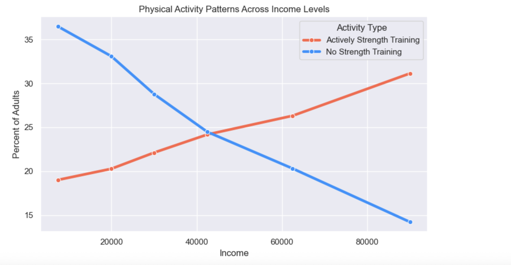

# 💪 Strength Training & Income Analysis  
### Exploring the correlation between physical activity and earning potential using CDC BRFSS data

This project analyzes whether adults who regularly perform strength-training exercises also tend to fall into higher income brackets.  
Using publicly available CDC BRFSS survey data, I cleaned, modeled, and visualized national health behavior trends to uncover strong relationships between income and physical activity.

---

## 🧠 Project Overview

**Research Question:**  
Do higher income groups report more frequent strength-training behavior compared to lower income groups?

**Summary:**  
Using Python and Jupyter Notebook, I cleaned CDC BRFSS survey data, converted income ranges into numeric midpoints, and applied correlation and regression models.  
The results show a *near-perfect* positive relationship between income and the percentage of adults who strength train ≥2 days per week.

---

### 📁 Project Files

| File | Description |
|------|-------------|
| 📘 [Capstone Project Notebook](Capstone%20Project.ipynb) | Full Jupyter Notebook containing data cleaning, analysis, visuals, and statistical tests |
| 📄 [Task 3 Capstone Report (PDF)](Report/Task%203%20Capstone%20.pdf) | Final written report submitted for WGU Task 3 |

## 📊 Key Findings

- **Pearson correlation:** **0.997** (p < 0.001)  
- **Spearman correlation:** **1.000**  
- **OLS Regression (Statsmodels):**  
  - R² = **0.994**  
  - Slope (β₁) = **0.0001**  
  - p < 0.001  
- **Interpretation:**  
  Higher income brackets consistently report higher strength-training participation, while lower income brackets report more inactivity.

---

## 🛠️ Tools & Technologies

- **Python**  
- **Jupyter Notebook**  
- **Pandas** for cleaning and preparation  
- **NumPy** for numeric operations  
- **Seaborn & Matplotlib** for data visualization  
- **SciPy** for Pearson & Spearman correlation  
- **Statsmodels** for OLS regression  

---

## 📂 Project Structure

---

## 📈 Sample Visuals

### Strength Training vs Income  

### Strength Training & Inactivity Trends  

---

## 🔍 Methodology (Short Version)

1. **Imported and inspected** CDC BRFSS dataset.  
2. **Filtered** for the "muscle-strengthening" survey question.  
3. **Filtered** for records stratified by *Income*.  
4. **Converted** income ranges into numeric midpoints for modeling.  
5. **Cleaned** missing values and grouped by income bracket.  
6. **Calculated** Pearson and Spearman correlations.  
7. **Ran** a simple linear regression model (OLS).  
8. **Visualized** the relationship using scatterplots, line charts, and dual-line comparisons.

---

## 📌 Dataset Source

**Dataset:**  
CDC Behavioral Risk Factor Surveillance System  
*Kaggle Source:*  
https://www.kaggle.com/datasets/spittman1248/cdc-data-nutrition-physical-activity-obesity

---

## 🎥 Presentation Video  
Will add at a later date

---

## 📝 About the Project

This project was completed as part of the  
**Bachelor of Science in Data Analytics Capstone (D502)**  
at **Western Governors University**.

It demonstrates skills in:  
- Data cleaning  
- Data visualization  
- Statistical analysis  
- Regression modeling  
- Communicating technical insights  
- Python + Jupyter workflows  

---

## 🙋 Author

**Matthew Irvin**  
Pittsburgh, PA  
GitHub: [MatthewJay412](https://github.com/MatthewJay412)

